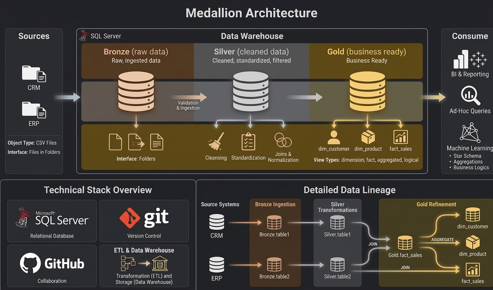

# SQL Data Warehouse Project

A personal, hands-on data warehouse build using SQL Server, put together while following **Data With Baraa's** SQL Data Warehouse course. This repo tracks my own implementation and notes as I work through the project end to end.

Course reference: [Data With Baraa – SQL Data Warehouse Project](https://github.com/DataWithBaraa/sql-data-warehouse-project)

---

## About This Project

This is a portfolio project built to practice real-world data engineering skills: taking raw source data, cleaning and modeling it, and turning it into something a business could actually query and report on. I'm building it layer by layer and documenting decisions as I go, rather than just following along passively.

**What I'm practicing here:**
- Designing a layered data architecture
- Writing ETL scripts to move and transform data
- Building a star schema for analytical queries
- Documenting a project the way it would need to be handed off to a team

---

## Architecture



Following the Medallion approach from the course — raw data moves through three layers before it's ready for reporting:

- **Bronze** — raw source data loaded as-is from CSV files into SQL Server, no transformations
- **Silver** — cleaned, standardized, and de-duplicated data, ready for modeling
- **Gold** — final star schema (fact and dimension tables) built for reporting and analytics

---

## Repository Structure

```
sql-data-warehouse-project/
│
├── datasets/              # Source CSV files (ERP and CRM data)
│
├── docs/                  # Notes, diagrams, and documentation
│   ├── architecture.md    # My notes on the layer design and decisions made
│   ├── data_catalog.md    # Field descriptions for the datasets used
│   └── naming-conventions.md
│
├── scripts/
│   ├── bronze/            # Load raw data into staging tables
│   ├── silver/            # Cleaning and transformation scripts
│   └── gold/               # Final star schema views/tables
│
├── tests/                 # Data quality checks
│
└── README.md
```

---

## Tools Used

- SQL Server + SSMS for the database and scripts
- Git / GitHub for version control
- VS Code for editing and repo management

---

## Progress Notes

I'll be updating `docs/` as I go with what I learned at each stage, any issues I ran into, and how I solved them — partly for my own reference, partly so this repo reads as a real build log rather than a one-time dump.

---

## Credit

Built while following the free course and project guide by **Baraa Khatib Salkini (Data With Baraa)**. Course and materials: [datawithbaraa.com](https://www.datawithbaraa.com)

---

## Contact

- LinkedIn: [linkedin.com/in/momen-ashraf-](https://linkedin.com/in/momen-ashraf-)
- GitHub: [github.com/Moamen-Ashraf](https://github.com/Moamen-Ashraf)
